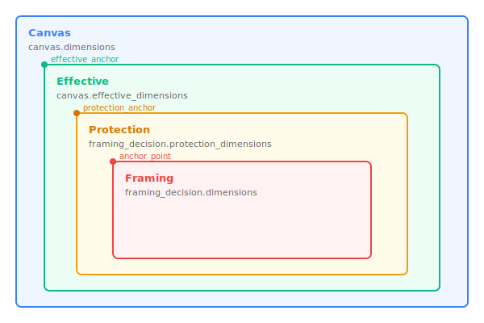
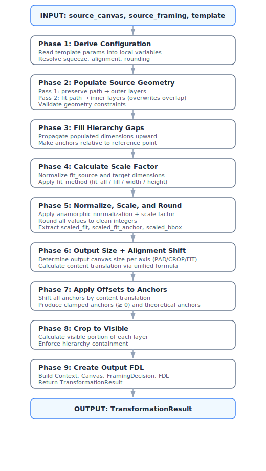
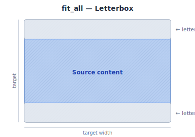
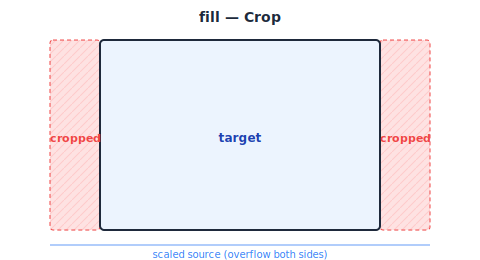
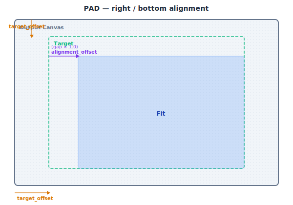
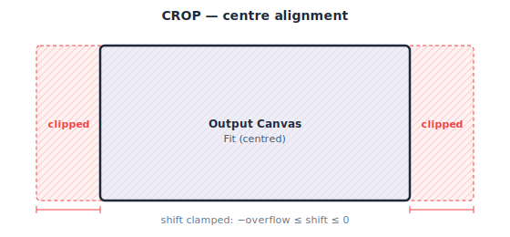
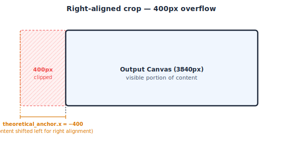

# FDL Template Application -- Implementer Guide

## Overview

The `CanvasTemplate.apply()` method transforms source canvas and framing geometry
according to a CanvasTemplate specification. It produces a new FDL structure with properly
scaled, rounded, and positioned geometry suitable for VFX work.

**Implementation**:

| File | Purpose |
|------|---------|
| `native/core/src/fdl_template.cpp` | Main 10-phase pipeline |
| `native/core/src/fdl_geometry.cpp` | Geometry operations (fill, scale, round, offset, crop) |
| `native/core/src/fdl_pipeline.cpp` | Scale factor, output sizing, alignment shift |
| `native/core/include/fdl/fdl_core.h` | Public C API declarations |

All language bindings (Python, C++ RAII) call through to the C library above.

**FDL Spec Reference**: Section 7.4 -- Template Application Algorithm

## Table of Contents

1. [Core Concepts](#1-core-concepts)
2. [Data Structures](#2-data-structures)
3. [Pipeline Overview](#3-pipeline-overview)
4. [Phase-by-Phase Breakdown](#4-phase-by-phase-breakdown)
5. [Edge Cases & Special Handling](#5-edge-cases--special-handling)
6. [Output Generation](#6-output-generation)
7. [Complete Formula Reference](#7-complete-formula-reference)
8. [Summary](#8-summary)

---

## 1. Core Concepts

### 1.1 The Geometry Hierarchy

FDL defines a nested hierarchy of rectangles from outermost to innermost:



**Key Paths** (defined in `PATH_HIERARCHY`):

| Path | Anchor | Description |
|------|--------|-------------|
| `canvas.dimensions` | (0, 0) always | Full canvas/sensor size |
| `canvas.effective_dimensions` | `effective_anchor_point` | Active image area within canvas |
| `framing_decision.protection_dimensions` | `protection_anchor_point` | Protected zone -- should not be cropped |
| `framing_decision.dimensions` | `anchor_point` | Creative framing area |

The hierarchy must always satisfy: **canvas >= effective >= protection >= framing**.

### 1.2 Template Parameters

A `CanvasTemplate` controls the transformation:

| Parameter | Type | Purpose |
|-----------|------|---------|
| `fit_source` | `GeometryPath` | Which source dimension to fit into target |
| `target_dimensions` | `DimensionsInt` | Target canvas size |
| `fit_method` | `FitMethod` | How to fit: `fit_all`, `fill`, `width`, `height` |
| `preserve_from_source_canvas` | `GeometryPath` | Which hierarchy levels to preserve |
| `maximum_dimensions` | `DimensionsInt` | Hard crop/pad limit |
| `pad_to_maximum` | `bool` | Whether to pad output to maximum_dimensions |
| `alignment_method_horizontal` | `HAlign` | Horizontal positioning: `left`, `center`, `right` |
| `alignment_method_vertical` | `VAlign` | Vertical positioning: `top`, `center`, `bottom` |
| `round` | `RoundStrategy` | Rounding rules (even/whole, up/down/round) |
| `target_anamorphic_squeeze` | `float` | Target squeeze (0 = preserve source) |

### 1.3 Key Terminology

- **Fit Source**: The source dimension layer that will be scaled to match the target.
- **Preserve Source**: Additional source layers to carry through the transformation.
- **Anchor Point**: The position of a layer relative to the canvas origin.
- **Anamorphic Squeeze**: Horizontal compression factor for anamorphic content.
- **Bounding Box**: The scaled canvas dimensions before any crop or pad -- the outer boundary of all content.
- **Content Translation**: The pixel shift applied to the entire scaled content to position it within the output canvas.

---

## 2. Data Structures

### 2.1 The Geometry Container

**C API**: `fdl_geometry_t` (defined in `fdl_core.h`)

The geometry struct holds all dimensions and anchor points during processing:

```
fdl_geometry_t:
    canvas_dims      : fdl_dimensions_f64_t   // Full canvas dimensions
    effective_dims   : fdl_dimensions_f64_t   // Effective area dimensions
    protection_dims  : fdl_dimensions_f64_t   // Protection zone dimensions
    framing_dims     : fdl_dimensions_f64_t   // Framing area dimensions
    effective_anchor : fdl_point_f64_t        // Effective area position
    protection_anchor: fdl_point_f64_t        // Protection zone position
    framing_anchor   : fdl_point_f64_t        // Framing area position
```

**Design Rationale**: Using floating-point throughout allows precise intermediate calculations before
final rounding. This prevents cumulative rounding errors.

**Operations** (C API):

| Function | Purpose |
|----------|---------|
| `fdl_geometry_fill_hierarchy_gaps()` | Propagate populated layers upward to fill zero layers |
| `fdl_geometry_normalize_and_scale()` | Apply anamorphic normalization + scale factor |
| `fdl_geometry_round()` | Apply FDL rounding rules to all values |
| `fdl_geometry_apply_offset()` | Apply content translation to all anchors |
| `fdl_geometry_crop()` | Crop dimensions to visible portion within canvas |
| `fdl_geometry_get_dims_anchor_from_path()` | Look up dimensions/anchor by path string |

### 2.2 Dimensions Types

**C API**: `fdl_dimensions_i64_t` and `fdl_dimensions_f64_t` (defined in `fdl_core.h`)

```
fdl_dimensions_i64_t:       fdl_dimensions_f64_t:
    width  : int64              width  : double
    height : int64              height : double
```

Both types support:

- Zero check -- check if dimensions are (0, 0)
- `fdl_dimensions_normalize()` -- apply anamorphic squeeze: `width *= squeeze`
- `fdl_dimensions_normalize_and_scale()` -- combined normalize + scale operation
- `fdl_dimensions_round()` -- apply FDL rounding rules
- `fdl_dimensions_clamp_to_dims()` -- clamp to upper bounds, returning delta

### 2.3 Point Type

**C API**: `fdl_point_f64_t` (defined in `fdl_core.h`)

```
fdl_point_f64_t:
    x : double
    y : double
```

Provides arithmetic operations and:

- `fdl_point_normalize_and_scale()` -- same transformation as dimensions
- `fdl_point_round()` -- apply FDL rounding rules
- `fdl_point_clamp()` -- constrain to lower bounds (typically 0.0)

### 2.4 Template Result

**C API**: `fdl_template_result_t` (defined in `fdl_core.h`)

The output of `fdl_apply_canvas_template()`:

```
fdl_template_result_t:
    output_fdl          : fdl_doc_t*      // Complete output FDL document
    context_label       : string          // Label of the created context
    canvas_id           : string          // ID of the created canvas
    framing_decision_id : string          // ID of the created framing decision
    error               : string          // Error message on failure (NULL on success)
```

**Language bindings**: Python returns `TemplateResult` with convenience properties
(`.context`, `.canvas`, `.framing_decision`) that resolve the objects by their IDs
from the contained FDL. The C++ RAII header wraps this as `fdl::TemplateResult`.

The `scale_factor`, `scaled_bounding_box`, and `content_translation` values are
stored as custom attributes on the output canvas rather than as separate result
fields.

### 2.5 Anamorphic Squeeze Handling

Dimensions must be normalized before scaling to handle anamorphic content:

```
# Normalize: Apply squeeze to get true aspect ratio
normalized_width = width * anamorphic_squeeze

# Scale: Apply scale factor then target squeeze
scaled_width = (normalized_width * scale_factor) / target_squeeze
scaled_height = height * scale_factor
```

Per ASC FDL Spec 7.4.5: *"All applications reading an ASC FDL will apply the squeeze factor
before any scaling to ensure consistency."*

---

## 3. Pipeline Overview

The transformation follows a strict order of operations:



---

## 4. Phase-by-Phase Breakdown

### 4.1 Phase 1: Derive Configuration

**C++ implementation**: `fdl_template.cpp`, `apply_canvas_template()` lines 153-179

All template parameters are read once and stored as local variables. There is no
separate context object -- values are threaded through helper functions via arguments.

```
input_squeeze  = source_canvas.anamorphic_squeeze  (default 1.0)
target_squeeze = template.target_anamorphic_squeeze (default 1.0)
if target_squeeze == 0.0:
    target_squeeze = input_squeeze    # Preserve source squeeze

fit_method    = template.fit_method                 (default FIT_ALL)
preserve_path = template.preserve_from_source_canvas (default "")
max_dims      = template.maximum_dimensions
has_max_dims  = max_dims is not null and not max_dims.is_zero()
h_align       = template.alignment_method_horizontal (default CENTER)
v_align       = template.alignment_method_vertical   (default CENTER)
target_dims   = template.target_dimensions           (as float)
```

### 4.2 Phase 2: Populate Source Geometry

**C++ implementation**: `fdl_template.cpp`, `populate_from_path()` + `populate_layer()`

Builds a `fdl_geometry_t` by reading dimensions and anchors from the source FDL.
Two template paths control what is read:

1. **`preserve_from_source_canvas`** (preserve path) -- the outermost layer to keep.
   Populates this level and all layers **below** it in the hierarchy.
2. **`fit_source`** (fit path) -- the layer that will be fitted to the target.
   Populates this level and all layers **below** it, **overwriting** any overlap
   with preserve.

#### The two-pass mechanism

Population starts with an all-zeros geometry, then calls
`populate_from_path` **twice** into the same structure:

```
# Pass 1: preserve paints first (the "background")
if preserve_path is not empty:
    populate_from_path(source_canvas, source_framing,
                       preserve_path, geometry)

# Pass 2: fit paints second (the "foreground" -- overwrites on overlap)
populate_from_path(source_canvas, source_framing,
                   fit_source, geometry)
```

Each call to `populate_from_path` starts at the given path's index in
`PATH_HIERARCHY` and iterates **downward** to the innermost layer:

```
populate_from_path(canvas, framing, start_path, geometry):
    start_index = PATH_HIERARCHY.index(start_path)
    for path in PATH_HIERARCHY[start_index:]:
        dims, anchor = fdl_resolve_geometry_layer(canvas, framing, path)
        if dims is not null:
            store dims and anchor in geometry at path's slot
```

The C API function `fdl_resolve_geometry_layer()` extracts dimensions and anchors
from the canvas/framing for a given geometry path. If the source FDL doesn't have
a given layer (e.g., no protection defined), the call returns null and that slot
stays at its zero default.

Both passes read from the **same** `source_canvas` and `source_framing`. When the
paths overlap, the second pass re-writes the same values -- the overwrite is a no-op
in practice. The two-pass design matters when the paths *don't* overlap: preserve
brings in the outer layers, fit brings in the inner layers.

#### Validation before population

Before any population happens, both paths are validated:

```
if preserve_path is not empty:
    fdl_resolve_geometry_layer(canvas, framing, preserve_path, required=true)
fdl_resolve_geometry_layer(canvas, framing, fit_source, required=true)
```

This catches mismatches early -- for example, if the template references
`framing_decision.protection_dimensions` but the source has no protection, a
descriptive error is raised explaining the problem and suggesting alternatives.

#### Worked examples

**Example A** -- `preserve = "canvas.effective_dimensions"`, `fit = "framing_decision.dimensions"` (common VFX pull):

| Index | Path | Pass 1 (preserve, start=1) | Pass 2 (fit, start=3) | Final |
|-------|------|------|------|-------|
| 0 | `canvas.dimensions` | not reached | not reached | **zero** |
| 1 | `canvas.effective_dimensions` | **written** | not reached | from preserve |
| 2 | `framing_decision.protection_dimensions` | **written** (if exists) | not reached | from preserve |
| 3 | `framing_decision.dimensions` | **written** | **overwritten** (same values) | from fit |

Canvas stays zero -- filled by Phase 3.

**Example B** -- `preserve = "canvas.effective_dimensions"`, `fit = "framing_decision.protection_dimensions"` (fit to safe zone):

| Index | Path | Pass 1 (preserve, start=1) | Pass 2 (fit, start=2) | Final |
|-------|------|------|------|-------|
| 0 | `canvas.dimensions` | not reached | not reached | **zero** |
| 1 | `canvas.effective_dimensions` | **written** | not reached | from preserve |
| 2 | `framing_decision.protection_dimensions` | **written** | **overwritten** (same values) | from fit |
| 3 | `framing_decision.dimensions` | **written** | **overwritten** (same values) | from fit |

Canvas stays zero -- filled by Phase 3. The key difference from Example A is **not**
in population (both produce the same geometry), but in what happens **downstream**:
`fit_source` determines which layer drives the scale factor in Phase 4. See
[Phase 4](#44-phase-4-calculate-scale-factor) for the consequences.

**Example C** -- `preserve = "canvas.dimensions"`, `fit = "framing_decision.protection_dimensions"`:

| Index | Path | Pass 1 (preserve, start=0) | Pass 2 (fit, start=2) | Final |
|-------|------|------|------|-------|
| 0 | `canvas.dimensions` | **written** | not reached | from preserve |
| 1 | `canvas.effective_dimensions` | **written** | not reached | from preserve |
| 2 | `framing_decision.protection_dimensions` | **written** | **overwritten** (same values) | from fit |
| 3 | `framing_decision.dimensions` | **written** | **overwritten** (same values) | from fit |

All four layers populated by pass 1; Phase 3 has no gaps to fill.

#### What stays zero?

Any layer **above** both the preserve path and the fit path is never reached and
stays zero. This is by design -- the template doesn't ask for it, so it's not
included. Phase 3 fills these gaps by propagating the outermost populated layer
upward.

#### After population

The resulting geometry is **validated**:
- Framing dimensions must be non-zero.
- Effective must not be smaller than protection (if both are present).

### 4.3 Phase 3: Fill Hierarchy Gaps

**C API**: `fdl_geometry_fill_hierarchy_gaps()`
**C++ implementation**: `fdl_geometry.cpp`, `geometry_fill_hierarchy_gaps()`

After population, some layers may be zero (not present in the source). The hierarchy
is completed by propagating the outermost populated layer upward:

```
fill_hierarchy_gaps(geometry, anchor_offset):
    # Find the highest-ranking non-zero dimension
    if not canvas.is_zero():
        reference_dims   = canvas
        reference_anchor = (0.0, 0.0)    # Canvas has no anchor
    else if not effective.is_zero():
        reference_dims   = effective
        reference_anchor = effective_anchor
    else if not protection.is_zero():
        reference_dims   = protection
        reference_anchor = protection_anchor
    else:
        reference_dims   = framing
        reference_anchor = framing_anchor

    # Fill gaps upward
    if canvas.is_zero():
        canvas = copy(reference_dims)
    if effective.is_zero():
        effective        = copy(reference_dims)
        effective_anchor = copy(reference_anchor)

    # CRITICAL: Protection is NEVER filled from framing
    # It stays zero if not explicitly provided
```

**Why Protection Is Special**: Protection dimensions represent an optional safe zone that
must be explicitly defined. If the source FDL doesn't have protection, the output shouldn't
fabricate it.

**Anchor Offset Calculation**:

```
# Determine reference anchor for relative positioning
fit_dims, fit_anchor         = geometry.get_dims_anchor_from_path(fit_source)
preserve_dims, preserve_anchor = geometry.get_dims_anchor_from_path(preserve_path)

# Use preserve anchor if specified, otherwise fit anchor
anchor_offset = fit_anchor if preserve_dims.is_zero() else preserve_anchor
```

All anchors are then made relative to this offset:

```
effective_anchor  -= anchor_offset
protection_anchor -= anchor_offset
framing_anchor    -= anchor_offset
```

### 4.4 Phase 4: Calculate Scale Factor

**C API**: `fdl_calculate_scale_factor()`
**C++ implementation**: `fdl_pipeline.cpp`, `calculate_scale_factor()`

Determine the uniform scale factor that transforms the `fit_source` layer to match
the target dimensions. The `fit_dims` used here are the ones extracted for the
`fit_source` path during Phase 3.

```
# Normalize dimensions for proper aspect ratio comparison
fit_dims_norm    = fdl_dimensions_normalize(fit_dims, input_squeeze)
target_dims_norm = fdl_dimensions_normalize(target_dims, target_squeeze)

scale_factor = fdl_calculate_scale_factor(fit_dims_norm, target_dims_norm, fit_method)
```

#### How `fit_source` choice affects scaling

Because **all** layers are scaled by the same uniform factor, the choice of
`fit_source` determines which layer ends up matching the target -- and consequently
whether the other layers overflow or underflow:

| `fit_source` | Scaled to target | Layers **smaller** than target | Layers **larger** than target (overflow) |
|---|---|---|---|
| `framing_decision.dimensions` | framing | -- | protection, effective, canvas |
| `framing_decision.protection_dimensions` | protection | framing | effective, canvas |
| `canvas.effective_dimensions` | effective | framing, protection | canvas |
| `canvas.dimensions` | canvas | framing, protection, effective | -- |

Overflow layers extend beyond the target and may require cropping (Phase 6).
Underflow layers are smaller than the target and sit inside it, positioned by
alignment.

**Example**: With `fit_source = "framing_decision.protection_dimensions"`:
- Protection is scaled to match the target exactly.
- Framing (smaller than protection) ends up smaller than the target.
- Effective and canvas (larger than protection) overflow the target.
- In Phase 6, the alignment shift positions **protection** within the output
  (`gap ~= 0` since protection matches the target), while the bounding box
  overflow is handled by crop clamping or padding.

#### Fit methods

```
calculate_scale_factor(fit_norm, target_norm, fit_method):
    if fit_method == FIT_ALL:
        # Fit entirely within target (letterbox/pillarbox if needed)
        return min(target_norm.width / fit_norm.width,
                   target_norm.height / fit_norm.height)
    else if fit_method == FILL:
        # Fill target completely (may crop)
        return max(target_norm.width / fit_norm.width,
                   target_norm.height / fit_norm.height)
    else if fit_method == WIDTH:
        return target_norm.width / fit_norm.width
    else if fit_method == HEIGHT:
        return target_norm.height / fit_norm.height
```

**Visual Examples**:





### 4.5 Phase 5: Normalize, Scale, and Round

**C API**: `fdl_geometry_normalize_and_scale()` + `fdl_geometry_round()`
**C++ implementation**: `fdl_geometry.cpp`

Apply the scale factor to **all** dimensions and anchors uniformly, then round.

```
geometry = fdl_geometry_normalize_and_scale(geometry,
    source_squeeze  = input_squeeze,
    scale_factor    = scale_factor,
    target_squeeze  = target_squeeze)

geometry = fdl_geometry_round(geometry, round_strategy)
```

**The Normalize-and-Scale Formula** (per ASC FDL spec 7.4.5):

For dimensions:
```
width_out  = (width_in  x source_squeeze x scale_factor) / target_squeeze
height_out = height_in x scale_factor
```

For anchor points:
```
x_out = (x_in x source_squeeze x scale_factor) / target_squeeze
y_out = y_in x scale_factor
```

**Rounding Configuration** (`RoundStrategy`):

| Property | Values | Description |
|----------|--------|-------------|
| `even` | `"whole"`, `"even"` | Round to any integer vs even integers only |
| `mode` | `"up"`, `"down"`, `"round"` | Ceiling, floor, or nearest |

**Examples**:

| Value | even="whole", mode="up" | even="even", mode="up" |
|-------|------------------------|----------------------|
| 1919.5 | 1920 | 1920 |
| 1919.1 | 1920 | 1920 |
| 1921.1 | 1922 | 1922 |
| 1920.0 | 1920 | 1920 |

**Why Round Before Alignment**: Clean integer dimensions ensure that alignment
calculations produce precise pixel positions, avoiding sub-pixel positioning issues.

After rounding, the scaled values are extracted for use in Phase 6:

```
scaled_fit, scaled_fit_anchor = fdl_geometry_get_dims_anchor_from_path(geometry, fit_source)
scaled_bounding_box = geometry.canvas_dims    # Full bounding box before crop/pad
```

### 4.6 Phase 6: Output Size and Alignment Shift

**C++ implementation**: `fdl_template.cpp`, lines 256-286

This phase combines what were previously separate "crop to max", "pad", and "align" phases
into a single unified calculation, evaluated independently per axis.

#### Step 1: Determine Output Size Per Axis

**C API**: `fdl_output_size_for_axis()`

```
output_size_for_axis(canvas_size, max_size, has_max, pad_to_max):
    if has_max and pad_to_max:      return max_size    # PAD
    if has_max and canvas > max:    return max_size    # CROP
    return canvas_size                                  # FIT
```

| Mode | Condition | Output size | Description |
|------|-----------|-------------|-------------|
| **PAD** | `has_max` and `pad_to_maximum` | `max_dims` | Expand to maximum dimensions |
| **CROP** | `has_max` and `canvas > max` | `max_dims` | Clamp canvas to maximum |
| **FIT** | No max constraint | `canvas` | Use canvas as-is |

Note: each axis is evaluated independently -- one axis may PAD while the other CROPs.

#### Step 2: Calculate Alignment Shift Per Axis

**C API**: `fdl_alignment_shift()`

The content translation (how many pixels to shift the entire scaled content) is calculated
using a unified formula that handles PAD and CROP identically.

**Alignment factors**:

| Alignment | Factor |
|-----------|--------|
| `left` / `top` | 0.0 |
| `center` | 0.5 |
| `right` / `bottom` | 1.0 |

##### FIT Regime

If `output_size == canvas_size` and `pad_to_maximum` is off: the geometry is already
correctly positioned. **Return 0.**

##### PAD / CROP Regime (Unified)

The shift is the sum of three independent offsets:

```
shift = target_offset + alignment_offset - fit_anchor
```

**1. Target offset** -- where the target region starts in the output:

```
center_target = pad_to_maximum OR is_center
target_offset = (output_size - target_size) x 0.5   if center_target
              = 0                                    otherwise
```

When padding (`pad_to_maximum`), the target region is always centred in the larger
output canvas. When using centre alignment, centring in the output is mathematically
equivalent. When neither applies, the target sits at the output origin.

**2. Alignment offset** -- where the fit sits within the target:

```
gap = target_size - fit_size
alignment_offset = gap x align_factor
```

| Alignment | Effect | Description |
|-----------|--------|-------------|
| left/top (0.0) | `0` | Fit snapped to target left/top edge |
| center (0.5) | `gap x 0.5` | Fit centred within target |
| right/bottom (1.0) | `gap` | Fit snapped to target right/bottom edge |

When `gap > 0`, the fit is smaller than the target and there is room.
When `gap < 0`, the fit is larger (overflow), and the alignment determines which part
is visible.

**3. Fit anchor compensation** -- `-fit_anchor`:

The fit_source may not start at position (0, 0) within the bounding box. The
`fit_anchor` is the offset from the canvas origin to the fit_source origin. This is
subtracted to align the fit_source itself (not the bounding box).

##### Clamp for Crop

When cropping without padding (`pad_to_maximum` is off and `overflow > 0`), the content
must fill the entire output -- no empty space allowed:

```
shift = max(min(shift, 0.0), -overflow)
```

This ensures:
- `shift <= 0`: content starts at or before the output origin (no left/top gap)
- `shift >= -overflow`: content extends to or beyond the output end (no right/bottom gap)

##### Visualization: PAD with right/bottom alignment



##### Visualization: CROP with centre alignment



### 4.7 Phase 7: Apply Offsets to Anchors

**C API**: `fdl_geometry_apply_offset()`
**C++ implementation**: `fdl_geometry.cpp`, `geometry_apply_offset()`

The content translation from Phase 6 is applied to **all** anchor points:

```
new_anchor = original_anchor + content_translation
```

This produces two versions of each anchor:

- **Clamped anchors** (stored in the geometry): `max(new_anchor, 0)` -- used in the
  output FDL where anchors cannot be negative.
- **Theoretical anchors** (returned separately): the raw unclamped values -- used in
  Phase 8 to calculate how much of each layer is visible.

Theoretical anchors can be **negative** when content extends off the left/top edge
of the output canvas (e.g., right-aligned crop).

### 4.8 Phase 8: Crop to Visible

**C API**: `fdl_geometry_crop()`
**C++ implementation**: `fdl_geometry.cpp`, `geometry_crop()`

Calculate the **visible portion** of each layer within the output canvas. This is not
a destructive pixel crop -- it computes what part of each geometry layer falls within the
canvas boundaries.

**Per-layer visible dimensions**:

```
crop_dim(dims, theo_anchor, clamped_anchor, canvas):
    clip_left  = max(0, -theo_anchor.x)
    clip_top   = max(0, -theo_anchor.y)
    visible_w  = dims.width - clip_left
    visible_h  = dims.height - clip_top
    visible_w  = min(visible_w, canvas.width - clamped_anchor.x)
    visible_h  = min(visible_h, canvas.height - clamped_anchor.y)
    return (max(0, visible_w), max(0, visible_h))
```

After individual clipping, the **hierarchy is enforced**:

```
visible_effective  = min(visible_effective, canvas)
visible_protection = min(visible_protection, visible_effective)   # if exists
visible_framing    = min(visible_framing, parent)                 # parent = protection or effective
```

This ensures inner layers never exceed their parent boundaries.

**Example** -- right-aligned crop with 400px X overflow:



---

## 5. Edge Cases & Special Handling

### 5.1 Protection Dimensions Never Auto-Filled

In `fdl_geometry_fill_hierarchy_gaps()`, protection is **never** filled from framing --
it stays zero if the source FDL did not explicitly provide protection dimensions.

**Rationale**: Protection dimensions represent an intentional safe zone. If the source FDL
doesn't define protection, it means "no protection required." Auto-filling would create
incorrect protection zones that weren't in the original spec.

### 5.2 Anchor Clamping

All anchors stored in the output FDL are clamped to non-negative values:

```
effective_anchor = clamp(original + offset, min=0.0)
```

**Rationale**: Negative anchors would place content outside the canvas, which is invalid
in the FDL schema. Clamping ensures all content starts at or within the canvas bounds.
The unclamped ("theoretical") anchors are used internally for visible area calculations.

### 5.3 Zero Anamorphic Squeeze Handling

```
target_squeeze = template.target_anamorphic_squeeze  (default 1.0)
if target_squeeze == 0.0:
    target_squeeze = input_squeeze
```

**Rationale**: A zero squeeze would cause division-by-zero errors. When explicitly set
to 0, it means "preserve source squeeze."

### 5.4 Validation Checks

The pipeline validates input geometry before processing:

```
# Framing dimensions must be non-zero
if source_geometry.framing_dims.is_zero():
    error("Framing decision dimensions not provided")

# Effective must be >= protection (if both specified)
if not source_geometry.effective_dims.is_zero()
   and not source_geometry.protection_dims.is_zero():
    if effective.width < protection.width
       or effective.height < protection.height:
        error("Source effective canvas dimensions are smaller than protection dimensions")
```

### 5.5 Path Hierarchy Validation

Template paths (`fit_source`, `preserve_from_source_canvas`) are validated against the
source FDL. If the source doesn't have the referenced layer (e.g., template references
`framing_decision.protection_dimensions` but the source has no protection), a descriptive
error is raised with guidance on how to fix it.

### 5.6 Exact Integer Comparison in FIT Regime

The FIT regime check uses exact comparison (`overflow == 0`) rather than float tolerance,
because all values are rounded integers at this point in the pipeline. This avoids
false matches where a small sub-pixel overflow would be treated as FIT.

---

## 6. Output Generation

### 6.1 Creating the Output Objects

**C++ implementation**: `fdl_template.cpp`, lines 298-473

The pipeline assembles the final output from the processed geometry:

**New Canvas**:
- `id` = caller-provided canvas ID
- `dimensions` = geometry.canvas_dims (as integer)
- `source_canvas_id` = source canvas ID (traceability link)
- `anamorphic_squeeze` = target squeeze
- `effective_dimensions` = geometry.effective_dims (as integer)
- `effective_anchor_point` = geometry.effective_anchor

**New Framing Decision**:
- `id` = `"{canvas_id}-{framing_intent_id}"`
- `dimensions` = geometry.framing_dims
- `anchor_point` = geometry.framing_anchor
- `protection_dimensions` = geometry.protection_dims (only if non-zero)
- `protection_anchor_point` = geometry.protection_anchor (only if protection non-zero)

**Custom Attributes on Output Canvas**:

The C++ implementation stores three computed values as custom attributes on the
output canvas for use by image processing pipelines:

| Attribute | Value | Purpose |
|-----------|-------|---------|
| `_scale_factor` | Uniform scale factor | Image scaling |
| `_scaled_bounding_box` | Pre-crop/pad canvas dims | Source content boundary |
| `_content_translation` | Pixel shift (x, y) | Image positioning |

**New Context and FDL**:
- Context contains both the source canvas (for reference) and the new output canvas
- FDL wraps the context, a default framing intent, and the applied template

### 6.2 Return Values

The C API returns a `fdl_template_result_t` containing the output FDL document and
IDs for resolving the created context, canvas, and framing decision.

| Field | Purpose |
|-------|---------|
| `output_fdl` | Complete, serializable FDL document |
| `context_label` | Resolves the context by label |
| `canvas_id` | Resolves the output canvas by ID |
| `framing_decision_id` | Resolves the output framing decision by ID |

---

## 7. Complete Formula Reference

For a single axis, the full content translation calculation is:

```
# Inputs (all rounded integers at this point)
canvas_size  = scaled bounding box on this axis
target_size  = template target dimensions on this axis
fit_size     = scaled fit_source dimensions on this axis
fit_anchor   = scaled fit_source anchor on this axis
align_factor = 0.0 (left/top), 0.5 (center), 1.0 (right/bottom)
pad_to_max   = template.pad_to_maximum

# Step 1: Output size
if has_max and pad_to_max:      output_size = max_size       # PAD
elif has_max and canvas > max:  output_size = max_size       # CROP
else:                           output_size = canvas_size    # FIT

# Step 2: Content translation
overflow = canvas_size - output_size

if overflow == 0 and not pad_to_max:
    shift = 0                                                # FIT

else:                                                        # PAD / CROP
    center_target    = pad_to_max or is_center
    target_offset    = (output - target) x 0.5  if center_target  else 0
    gap              = target_size - fit_size
    alignment_offset = gap x align_factor
    shift            = target_offset + alignment_offset - fit_anchor

    if not pad_to_max and overflow > 0:                      # Clamp for crop
        shift = max(min(shift, 0), -overflow)
```

---

## 8. Summary

### Order of Operations

| Phase | Operation | Key Consideration |
|-------|-----------|-------------------|
| 1 | Derive configuration | Template params -> local variables |
| 2 | Populate source geometry | `fit_source` overwrites `preserve` for overlapping paths |
| 3 | Fill hierarchy gaps | Protection is **NEVER** auto-filled |
| 4 | Calculate scale factor | Based on normalized (desqueezed) dimensions |
| 5 | Normalize, scale, round | All geometry scaled uniformly; round to clean integers |
| 6 | Output size + alignment | Unified PAD/CROP formula; each axis independent |
| 7 | Apply offsets | Produces clamped + theoretical anchors |
| 8 | Crop to visible | Enforce hierarchy containment |
| 9 | Create output | Protection only included if non-zero |

### Key Design Decisions

1. **Float throughout**: All calculations use `fdl_dimensions_f64_t` to prevent cumulative
   rounding errors.
2. **Round early**: Rounding happens after scaling but before alignment to ensure clean
   pixel boundaries.
3. **Protection is sacred**: Never auto-generate protection dimensions; they must be
   explicitly specified.
4. **Unified alignment**: PAD and CROP use the same formula
   (`target_offset + alignment_offset - fit_anchor`), eliminating special-case bugs.
5. **Exact integer comparison**: FIT regime uses `overflow == 0` (not float tolerance)
   because all values are rounded integers at this point.
6. **Anchors are relative**: After hierarchy preparation, anchors represent positions
   relative to the canvas origin.

### Common Scenarios

| Scenario | Configuration |
|----------|--------------|
| VFX Pull | `fit_source="framing_decision.dimensions"`, `fit_method="fit_all"` |
| Full Frame | `fit_source="canvas.dimensions"`, `fit_method="fill"` |
| Width Match | `fit_source="canvas.effective_dimensions"`, `fit_method="width"` |
| Padded Output | `pad_to_maximum=True`, `maximum_dimensions` set |
| Preserve Protection | `preserve_from_source_canvas="framing_decision.protection_dimensions"` |

### API Entry Points

**C API** (`fdl_core.h`):

```c
fdl_template_result_t fdl_apply_canvas_template(
    const fdl_canvas_template_t* tmpl,
    const fdl_canvas_t* source_canvas,
    const fdl_framing_decision_t* source_framing,
    const char* new_canvas_id,
    const char* new_fd_name,
    const char* source_context_label,
    const char* context_creator);
```

**Python** (`fdl.CanvasTemplate`):

```python
result = template.apply(
    source_canvas,
    source_framing,
    new_fd_name="...",
    source_context=context,       # optional
    context_creator="...",        # optional
)
# result.fdl, result.canvas, result.framing_decision, result.context
```

**C++ RAII** (`fdl::CanvasTemplate`):

```cpp
auto result = tmpl.apply(source_canvas, source_framing,
                         "canvas_id", "fd_name",
                         "context_label", "creator");
// result.fdl(), result.canvas(), result.framing_decision()
```

**TypeScript** (`CanvasTemplate`):

```typescript
const result = template.apply(
  sourceCanvas, sourceFraming,
  'canvas_id', 'fd_name',
  'context_label', 'creator',
);
// result.fdl, result.context, result.canvas, result.framingDecision
```
